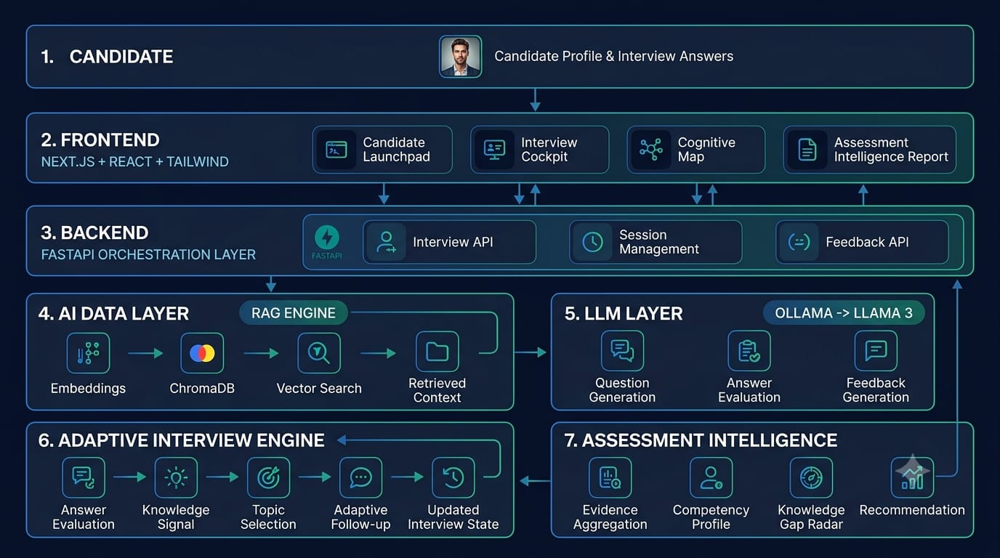

# 🚀 AI Interview Agent

🔗 **Live Demo:**https://abtalk-9lyy.vercel.app/

---

## 🧠 Overview

The AI Interview Agent is an intelligent system that conducts **realistic, multi-turn technical interviews** based on a candidate’s learning journey.

It simulates a real interviewer by adapting questions, maintaining context, and providing structured feedback.

---

## 🏗️ System Architecture

> High-level system design showing interaction between frontend, backend, AI layers, and adaptive interview engine.

---

## ✨ Key Features

- 🎯 Personalized interview experience  
- 🔁 Multi-turn conversational flow  
- 🧠 Adaptive follow-up questioning  
- 📚 Curriculum-aware questioning  
- 📊 Structured feedback & evaluation  
- 🌐 Fully deployed and accessible  
- 📱 Responsive interface  

---

## 🔄 How It Works

1. Candidate starts an interview  
2. System generates a question based on progress  
3. Candidate submits an answer  
4. AI:
   - Evaluates the response  
   - Generates a follow-up question  
5. Process continues for multiple rounds  
6. Final feedback is generated  

---

## 🧠 Core Concepts Used

- Prompt Engineering  
- Retrieval-Augmented Generation (RAG)  
- Context-aware conversations  
- Adaptive questioning  
- AI-based evaluation  

---

## ⚠️ Limitations

- No session persistence  
- No authentication system  
- Basic evaluation logic  

---

## 🔮 Future Improvements

- Add database support  
- Improve evaluation accuracy  
- Implement authentication  
- Enhance UI/UX  
- Add voice-based interviews  
